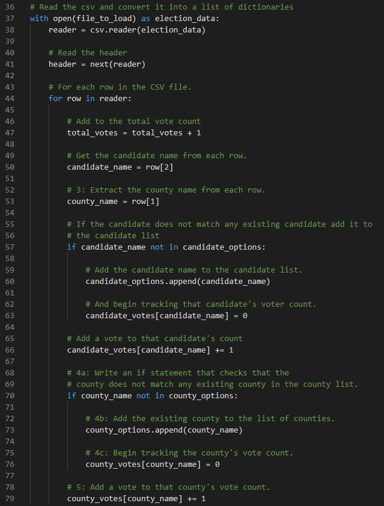
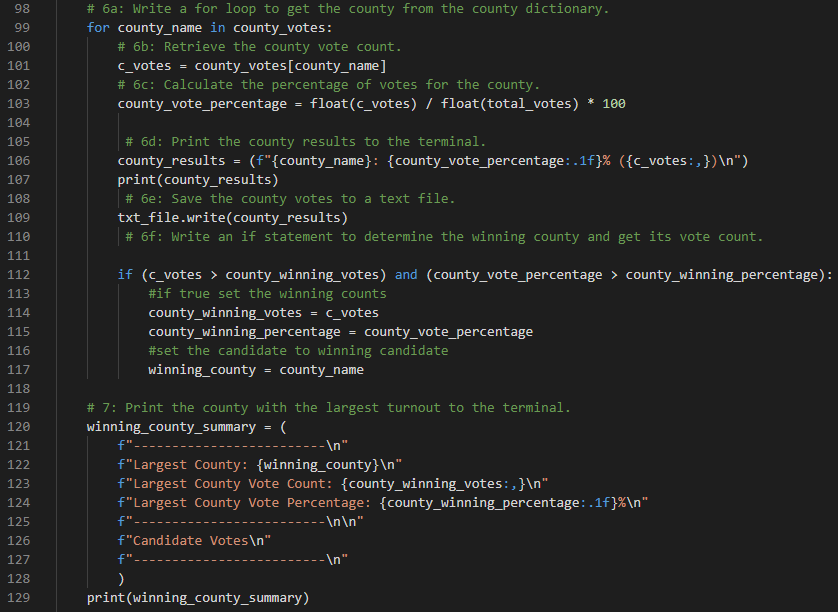
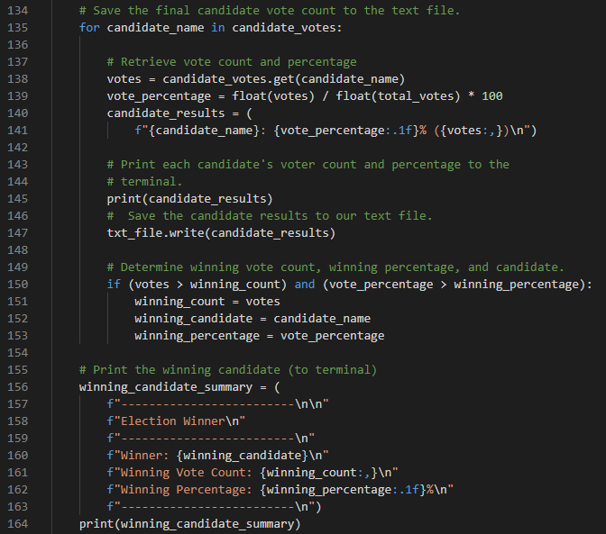

# Election Audit

## Overview of Audit  
---
Tom and Steve from the Colorado Board of Elections have enlisted my support in conducting an audit of a recent congressional election. After identifying the total number of votes cast, the total votes for each candidate, the percentage of votes for each candidate and the winner of the election by popular vote; The elction commission has requested we gather some additional data in order to complete their audit.

## Election Audit Results
--- 
- Using the [dataset provided](./resources/election_results.csv) by Tom , we used Python script in VS Code to run our election audit. We started with calculating the total votes cast in the precinct as well as the number of votes each candidate received.

### Election Results
---
    Total Votes: 369,711

Example code on collecting the total number of votes, votes per candidate and votes per county.

- Using this data, we were able to identify the number and percentage of votes for each county in the precinct including which county had the largest turnout.

### County Votes
---

    Jefferson: 10.5% (38,855)
    Denver: 82.8% (306,055)
    Arapahoe: 6.7% (24,801)
    Largest County: Denver

Example code on identifying total votesby county, percentage of votes by county and the county with the largest turnout.

- Finally we identified the number and percentage of votes for each candidate as well as the winner of the election by popular vote.

### Candidate Votes
---
    Charles Casper Stockham: 23.0% (85,213)
    Diana DeGette: 73.8% (272,892)
    Raymon Anthony Doane: 3.1% (11,606)

### Election Winner
---
    Winner: Diana DeGette
    Winning Vote Count: 272,892
    Winning Percentage: 73.8%

Example code on identifying total votesby candidate, percentage of votes by candidate and the candidate with the popular vote who won the election.

## Election Audit Summary 
In summary, we were successful in being able to automate the election audit and this script will be able to be used for other purposes.
-   This audit tool would be highly effective in smaller elections. By changing "county" to "city" you could use this same script to audit local county specific elections.
-   Alternatively, you could adjust the count to identify how many votes a candidate had in each county in an effort to know where to spend campaign dollars for the next election. 
